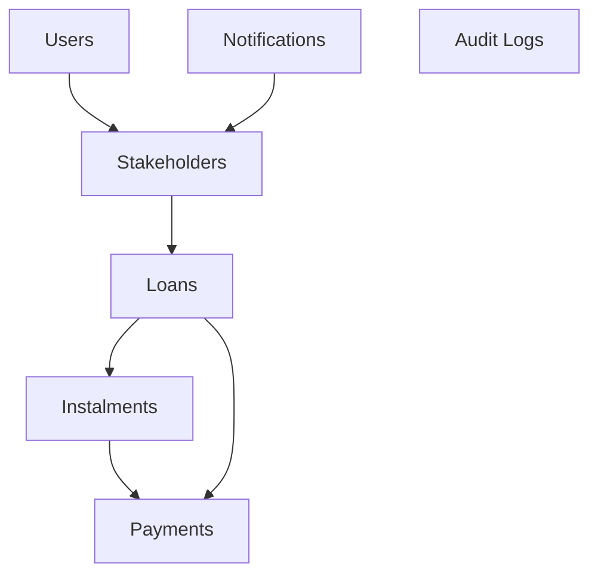

# Chipkie Website

## Install

 * Copy `.env.example` to `.env`
 * `docker volume create --name=chipkie_app_storage`
 * `docker volume create --name=chipkie_db_data`
 * `docker-compose up`
 * `docker-compose exec app mkdir -p storage/framework/{cache,views,sessions}`
 * `docker-compose exec app mkdir -p storage/logs`
 * `docker-compose exec -u root app chown -cR 9001 storage`
 * `docker-compose exec app composer install`
 * `docker-compose exec app php artisan migrate --seed`
 * `docker-compose exec app php artisan storage:link`
 * Browse to
   * http://localhost:9032 (app)
   * http://localhost:9034 (Mailhog)
   * and MariaDB (MySQL) instance is on port 9033.

Watch for file changes and hot reloads (run on local machine from root folder):

`npm run dev`

## Testing

Cypress (UI) tests

`npx cypress open`

Unit tests

`./vendor/bin/pest`

## Deployment

Commits to the `staging` or `production` branches will be auto-deployed via Gitlab CI/CD into their respective environments.

## Local development with Stripe

* Configure the test Stripe API keys in `.env`
* `brew install stripe/stripe-cli/stripe`
* `stripe login`
* `stripe listen --forward-to localhost:9032/stripe/webhook --forward-connect-to localhost:9032/connectWebhook`
* Use `4000000360000006` as the test card because this is a test _Australian_ card and we have disallowed cards from other locations for now.
  * Expiry any date in future (e.g. `12/34`)
  * CVN any 3 digits (e.g. `123`)
* To test BECS direct debit, use the following account details
  * BSB `000-000`
  * Account `000123456`
## Clearing Stripe test data

If you want to completely delete all test data in Stripe, this is the minimum you need to reconfigure manually:

1. Set up the "Personal Loan Contract" product as a one-off product and configure its `price_` ID as `CONTRACT_PRICE_ID`
1. Set up premium subscription and configure its `price_` ID as `PREMIUM_PRICE_ID`
1. Set up premium plus subscription and configure its `price_` ID as `PREMIUM_PLUS_PRICE_ID`

## Database ERD

## DB Tables

* `audit_logs`: Application logs of key events. Not exposed to users
* `connected_subscriptions`: Stripe subscriptions under a Connect account (i.e., subscriptions to loan repayments)
* `connected_subscription_items`: Line items for the above
* `countries`: Lookup table
* `failed_jobs`: Laravel failed jobs log
* `holidays`: Loan holiday requests
* `instalments`: All payment instalments for each loan
* `loan_tokens`: Used for authenticating loan invites
* `loan_users`: Stakeholders (loan parties) having `role` of `lender` or `borrower`. Assumptions throughout the app limit 1 of each.
* `loans`: Loans
  * `stripe_id`: The Stripe price ID for the automated repayments schedule
  * `status`: `active`, `hold`, `rejected`
* `migrations`: Laravel internal database versioning
* `app_notifications`: User-facing notifications surfaced on their dashboard
* `notifications`: Internal table for Filament
* `job_batches`: Internal table for Filament
* `exports`: Internal table for Filament
* `failed_import_rows`: Internal table for Filament
* `password_reset_tokens`: Laravel password reset
* `payments`: Loan paydowns, including unconfirmed cash lodgements (`source` can be `offline` or `stripe`)
* `personal_access_tokens`: Laravel API tokens (unused)
* `stripe_connect_mappings`: Maps Stripe Connect account IDs (`acct_`) back to internal users
* `stripe_connected_customer_mappings`: Stripe Connect accounts (lenders) contain their own direct customers (borrowers)
* `subscriptions`: Stripe subscriptions
  * `user_id`: Internal ID of the subscription customer (user)
  * `name`: `premium-<loan_id>` for Chipkie Premium subscriptions; `loan-<loan_id>` for loan repayments (FIXME)
  * `stripe_id`: Stripe subscription ID (`sub_*`)
  * `stripe_status`: e.g. `active`
  * `stripe_price`: Stripe price ID of the subscription (`price_*`). This will likely be one of the fixed IDs configured as `PREMIUM_PRICE_ID` or `PREMIUM_PLUS_PRICE_ID`
  * `quantity`: always 1
  * `trial_ends_at`: unused
  * `ends_at`: end date of Stripe subscription (unused?)
* `subscription_items`: Line items on Stripe subscriptions
  * `subscription_id`: fk to `subscriptions.id`
  * `stripe_id`: Stripe subscription item ID (`si_*`)
  * `stripe_product`: Stripe product ID on this line item (`price_*`)
  * `quantity`: always 1
* `users`: Chipkie users including admin (`admin` flag)
  * `stripe_id`: Stripe Customer ID (`cus_*`)

## Notification types

| Type | Recipient | Event |
| ---- | --------- | ----- |
| `awaiting_holiday` | Borrower | Holiday request awaiting pproval |
| `review_holiday` | Lender | Holiday request awaiting approval   |
| `accepted_holiday` | Borrower | Holiday request accepted |
| `rejected_holiday` | Borrower | Holiday request rejected |
| `awaiting_contract` | Loan creator | "Pay for your contract" after contract chosen during wizard |
| `pay_plan` | Loan creator | "Pay for your plan prompt" after premium selected during wizard |
| `welcome_invitee` | Invitee | Welcome to dashboard |
| `welcome_initiator` | Loan creator | Welcome to dashboard |
| `review_payment` | Lender | Request to review offline payment |
| `awaiting_payment` | Borrower | Offline payment is awaiting confirmation |
| `confirmed_payment` | Both | Offline payment was confirmed |
| `rejected_payment` | Borrower | Offline payment was rejected |
| `contract_ready` | Both | Contract is ready for signing |
| `complete_upgrade` | Plan upgrade initiator | Nag to complete plan upgrade |
| `complete_contract` | Contract purchase initiator | Nag to complete contract purchase |
| `contract_completed` | Both | Contract signed by all |
| `generate_contract` | Contract purchase initiator | Confirmation of contract purchase |
| `hold_loan` | Both | Loan placed on hold due to overdue payments |
| `overdue_payment` | Both | Payment was missed |
| `setup_stripe` | Plan upgrade initiator | Prompt to set up Stripe for automated payments upon plan upgrade |
| `plan_upgraded` | Plan upgrade non-initiator | Prompt to set up Stripe for automated payments upon plan upgrade |
| `plan_sub_cancelled` | Plan owner  | Confirmation that plan has been cancelled |
| `payment_sub_cancelled` | Plan non-owner | Confirmation that plan has been cancelled |
| `lender_stripe_set_up` | Borrower | Lender now set up to receive automated payments |
| `stripe_set_up` | Lender | Thanks for setting up to receive payments via Stripe |

## Stripe interactions

* On Premium subscription setup
  * Stripe webhook `checkout.session.completed`
  * Records in `subscriptions` and `subscription_items` are created (Laravel Cashier does this?)
  * `loans.plan` = `premium` or `premiumplus`
* On subscription payment
* On subscription payment failure
* On subscription cancellation
* If we delete a Chipkie account

## The Process

To edit this, load [sequencediagram.org.txt](doc/sequencediagram.org.txt) into [sequencediagram.org](https://sequencediagram.org).

